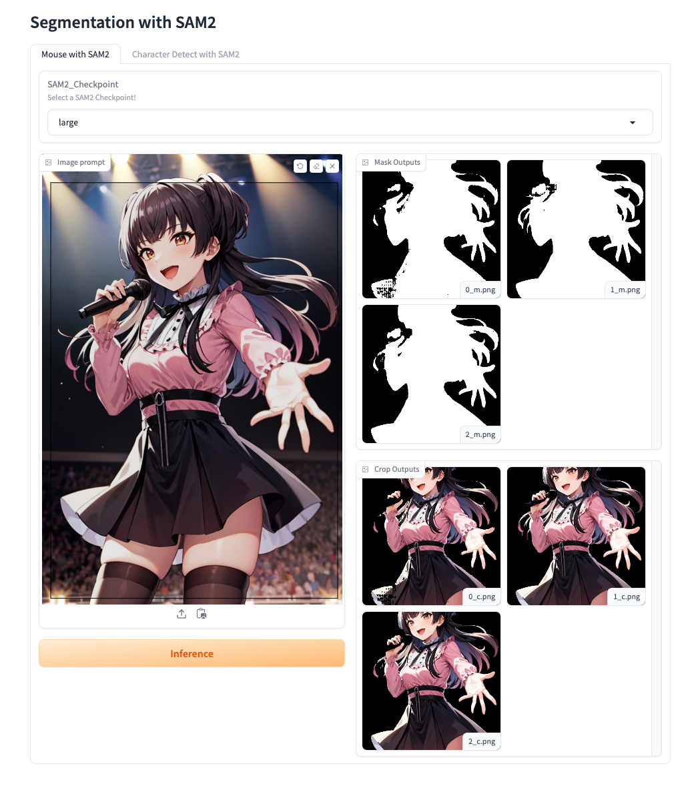

# Segmenation with SAM2

# Summary
- SAM2와 deepghs/imgutils의 Person Detecting을 사용한 캐릭터 Segmentation

# Used
- Python3.11.x
- <a href="https://github.com/facebookresearch/segment-anything-2">SAM2</a> 
- <a href="https://github.com/deepghs/imgutils">Person Detecting</a>
- Gradio

# DEMO
- Only SAM2
<br><br>
- Person Dectect + SAM2
<br>

# Download Checkpoint
```shell
chmod +x download.sh
# all
download.sh
# pick ex.large
download.sh --large
# tiny --tiny
# small --small
# base_plus --base
# large --large
```

# Install
```shell
git clone https://github.com/pupba/Character-Seg.git
cd Character-Seg
chmod +x run.sh
./run.sh
# GPU의 경우
./run.sh --gpu
```
